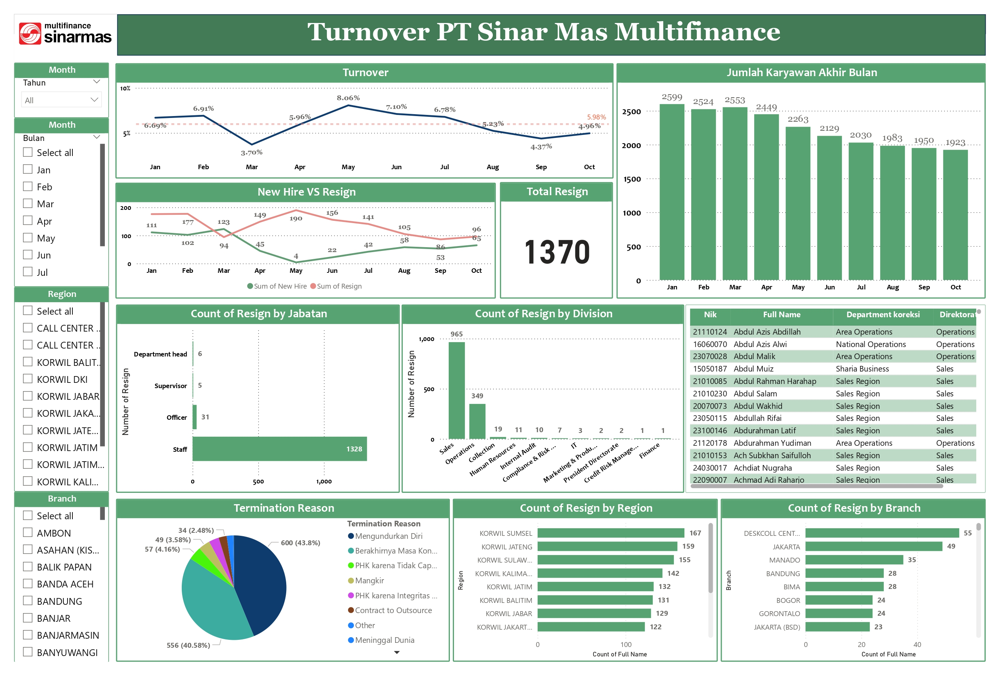

# HR Turnover Dashboard — PT Sinar Mas Multifinance

## Dashboard Preview


## Overview
An interactive HR Turnover Analytics Dashboard built with Power BI to monitor employee attrition trends, workforce headcount, and resignation patterns across all divisions, regions, and branches of PT Sinar Mas Multifinance.
The dashboard empowers the HR team to make data-driven decisions by surfacing key signals such as monthly turnover rates, resignation volumes, new hire trends, and termination reasons — all with dynamic filtering capabilities.

## Business Problem
HR teams at PT Sinar Mas Multifinance lacked a centralized, real-time view of employee turnover. Data was scattered across systems, making it difficult to:

- Detect early warning signs of high attrition in specific regions or job levels
- Compare new hire intake against resignation volumes month-over-month
- Understand the root causes behind employee terminations
- Prioritize retention efforts at the branch and division level

## Objectives
- Monitor monthly turnover rate against a defined threshold (5.98% target line)
- Analyze the gap between new hire and resignation volumes over time
- Identify divisions and regions with the highest attrition risk
- Break down resignations by job position (Staff, Officer, Supervisor, Department Head)
- Understand termination reasons (voluntary vs. involuntary)
- Support HR leadership with actionable, self-service reporting

## Tools Used
- Power BI (Dashboard development, data modeling, DAX measures)
- SQL (Data extraction and transformation from source systems)
- Excel (Data cleaning, staging, and supplementary analysis)

## Key Metrics
- Turnover Rate
- Active Employees
- New Hire Employees
- Resignation Count
- Monthly Attrition Trend

## Features
- Interactive filtering
- Department analysis
- Monthly trend monitoring
- Workforce breakdown analysis

## Project Structure
```text
screenshots/   -> dashboard preview images
documentation/ -> KPI definitions and business rules
powerbi/       -> Power BI files
sql/           -> SQL queries
```

## Dashboard Preview

